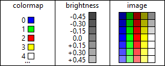

[← index](../index.md)

## Data file (`*.dat`)

**Important note:**  
Do not confuse this file format with the one present in *Cultures 2: The Gates
of Asgard* and in most of the newer games released as part of the *Cultures*
series. This file format is completely different from `map.dat` files.

### Introduction

The data file format is used only once in all the game files. This is
`gouraud.dat` file present in `data_v\ve_graphics\gouraud` directory after
extracting `data_l\data_v.lib` library. This file is used to store a
predefined table of brightness relations for indexed colormaps. Such idea is
visualized below. Note that each color present in the final image must be also
present in the original colormap. In case of `gouraud.dat` the appropriate
colormap is present in the file `data_v\gg_system\palette.pcx`. The
aforementioned file can store up to `256` unique shades.

Using `Converters.exe` application provided in the
[releases section](https://github.com/Mikulus6/Cultures-map-editor/releases)
one can freely decode a `*.dat` file or encode it back. Modifying this file
let the user change apparent brightness or color of shadows and light in the
game. The header of this file contains additional constant numbers which were
used during the development process to derive those shades of colors. Keep in
mind that while editing this file in [GIMP](https://www.gimp.org/) one must
keep it as an indexed colormap at all times. The name `gouraud.dat` comes from
the [Gouraud shading](https://en.wikipedia.org/wiki/Gouraud_shading)
interpolation algorithm.

### Historical trivia

File `gouraud.dat` appears not only in *Cultures: Discovery of Vinland*,
*Cultures: The Revenge of the Rain God* and *Cultures Gold*, but also in other
real-time strategy games released in the same era. These are *Knights and
Merchants: The Shattered Kingdom*, *Knights and Merchants: The Peasants
Rebellion* and *The Settlers II*. It has been confirmed that this file serves
the exact same purpose in the *Knights and Merchants* games, as it does in the
*Cultures* games. Considering that these games were created by the
same people working at [Joymania Entertainment](https://www.knightsandmerchants.net/information/joymania),
it is speculated that the aforementioned games share a common part of source
code.

### File format

For the algorithm used by the provided tools, one can look into the Python
file [`supplements/gouraud.py`](../../supplements/gouraud.py) present in this
repository.  Keep in mind that the exact specifications of this algorithm are
the same only for *Cultures: Discovery of Vinland*, *Cultures: The Revenge of
the Rain God* and *Cultures Gold*. There is another slightly different version
of this file format used in *Knights and Merchants: The Shattered Kingdom*,
*Knights and Merchants: The Peasants Rebellion*, *The Settlers II* and perhaps
in other real-time strategy games connected to [Joymania Entertainment](https://www.knightsandmerchants.net/information/joymania).