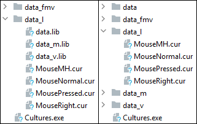

[← index](../index.md)

## Library (`*.lib`)

### Introduction

*Cultures* has multiple `*.lib` files, which are commonly referred to as
*libraries*. Each library is an archive having a potential to contain
multiple subdirectories and files within itself. Those files can be found
inside `data_l` directory present in game files.

Using `Converters.exe` application provided in [releases section](https://github.com/Mikulus6/Cultures-map-editor/releases)
one can freely extract or create `*.lib` files. Historically, [Game Extractor](https://www.watto.org/game_extractor.html)
was used to read those files and might be a considerable choice on old
operating systems due to its further backward compatibility than tools
provided as supplement for this documentation.

Libraries are rarely dynamically resizable. They can be extracted or created,
but it is uncommon to modify them by removing or adding singular files without
extracting the entire content first.

There are no compression algorithms present within the `*.lib` file format. It
is simply an organized collection of subdirectories and files put together as
one bigger file.

### Failsafe mechanism

It is important to note that every library present in game files can be
extracted to game's main directory. Subdirectories created this way will be
the primary sources of data for game while remaining library will act as a
failsafe for missing files.

Take for example the file `data\system\debug.fnt`, which by default is packed
inside `data_l\data.lib` archive.  
Starting from game's main directory, upon game initialization there will be
performed the following searches of this file:  
1. Find `data\system\debug.fnt`. If present, load it and end the search.
   Otherwise, go to the next point.
2. Find `data_l\data.lib` archive. Inside this archive, find packed data of
   `data\system\debug.fnt` file and load it.

Pay attention to the fact that the content extracted from `*.lib` files for
failsafe usage must be extracted specifically to game's main directory, not to
`data_l` folder, which is commonly mistaken for this purpose. As in previous
example, `data\system\debug.fnt` is the correct location, but
`data_l\data\system\debug.fnt` is not.

Due to this mechanism, it is a common practice to extract all `*.lib` files
before dealing with any other modifications of content present in game files.
This is because it is much easier to modify and manipulate extracted files
rather than deal with archives.

### Recommendations

Before dealing with any different filetype in *Cultures*, go to `data_l`
folder and extract three libraries present there to game's main directory
using converters provided in [releases section](https://github.com/Mikulus6/Cultures-map-editor/releases).
These libraries are `data.lib`, `data_m.lib` and `data_v.lib`. If there are
any collisions between files extracted from these libraries and those already
present in destined location, it is not recommended to replace them. However,
merging directories with same names is fine. Note that capitalization of names
is not important in this case.

After extracting the mentioned archives, one can delete or temporarily remove
`*.lib` files from their initial location and try to run the game, which, if
properly working, indicates the correctness of performed extractions.
Make sure to have a backup of files meant for deletion in case something goes
wrong.

Below is the comparison of simplified game files before and after the
recommended extraction and removal of libraries.  

### File format

For the algorithm used by the provided tools, one can look into the Python
file [`supplements/library.py`](../../supplements/library.py) present in this
repository. Library file format was firstly documented for Game Extractor's
specifications of [Archive_LIB](https://www.watto.org/specs.html?specs=Archive_LIB)
plugin. Keep in mind, this archive format is correct only for *Cultures:
Discovery of Vinland*, *Cultures: The Revenge of the Rain God* and *Cultures
Gold*. It is not correct for libraries present in *Cultures 2: The Gates of
Asgard* or for those present in any newer game released as part of *Cultures*
series.