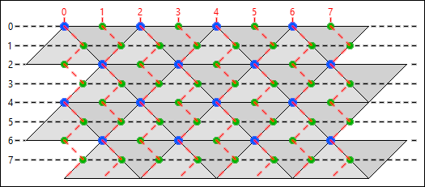

[← index](../index.md)

## Map file `(*.map)`

### Introduction

Map files are directly responsible for terrain-related properties of maps
present in *Cultures*. These properties are in great numbers. The most
important of them are terrain triangles types, heightmap, landscapes and
road/water/snow overlay. This file format is directly supported by
`Editor.exe` present in [*releases section*](https://github.com/Mikulus6/Cultures-map-editor/releases).

Maps as a general concept can be divided into so-called cleanmaps and
macromaps. Cleanmap is the type of map which is seen directly by the user
during gameplay, while macromap is the technical term for a special type of
brush which can be used to paint terrain over a cleanmap. To distinguish
cleanmap and macromap from each other check the first byte of a `*.map` file
in any hexadecimal editor. If this byte has a value equal to `0x0C` it
indicates cleanmap presence.

### Map geometry

Terrain contained in `*.map` files is composed of a two-dimensional triangular
grid. Triangles present on such a grid can be divided into two types: triangles
A (Δ) and triangles B (∇). These two types of triangles always appear paired
with each other. Ignoring distortion caused by heightmap, the composition of a
pair of triangles is a parallelogram (Δ∇).

Vertices present in top left corners of parallelograms composed of paired A
triangle and B triangle are called *macro vertices*. In game, coordinates of
such vertices satisfy the following equation: `y mod 4 = 2·(x mod 2)`.

Additional vertices can be obtained by shifting any macro vertex. Vertices
obtained in this way always lie on edge of triangle A or triangle B. The
distance of the aforementioned shift is equal to half the length of the edge
along which the vertex is being shifted. These newly created vertices are
called *micro vertices*. In game, coordinates of such vertices are always a
pair of integers ranging from zero to one less than the appropriate map
dimension.

Macro vertices and micro vertices together make all the vertices on which
landscapes can be placed and between which creatures can move. When working
on problems related to these concepts it is useful to imagine only vertices
without underlying triangles. One can easily see that by rotating the image of
flat terrain by 45° the structure of vertices is geometrically equivalent to
the regular grid made out of squares. This explains intuitively why creatures
in game can move in eight directions, which inherently is caused by triangles
not having all sides of the same length.

For cases without the constraint of predefined visual distance between
vertices one can notice that moving on triangular grid vertex by vertex is
topologically equivalent to moving on hexagonal grid tile by tile. This idea
in many cases simplifies required geometrical imagination.

It is important to note that vertical coordinate on this kind of grid does not
simply move in one direction as one might expect to happen by having intuition
from grids based on square repetition. Instead, vertical coordinate for all
triangles A, triangles B, macro vertices and micro vertices, moves in a zigzag
pattern.

All geometrical ideas described above are shown in the exemplary image below.

### File format

For the algorithm used by the provided tools, one can look into Python file
[*map.py*](../../map.py) present in this repository. Keep in mind that the exact
specifications of this algorithm are the same only for *Cultures: Discovery of
Vinland*, *Cultures: The Revenge of the Rain God* and *Cultures Gold*. There
is another version of this file format used in *Cultures 2: The Gates of
Asgard* and in most of newer games released as part of the *Cultures* series.
In these newer games this file format is called `*.dat` instead of `*.map`.
Differences between these two file formats are so significant, that despite
representing a very similar internal concept present in game, one should not
expect the internal structure of `*.map` files to be particularly useful when
decoding `*.dat` file format.