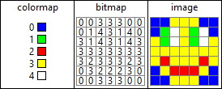

[← index](../index.md)

## Picture Exchange `(*.pcx)`

### Introduction

[Picture Exchange](https://en.wikipedia.org/wiki/PCX) is a common type of
image file, which is not exclusive to *Cultures* video games. However, not
every `*.pcx` file is compatible with mentioned game. All such files must use
indexed colormap with not more than 256 colors instead of commonly used [RGB](https://en.wikipedia.org/wiki/RGB_color_model)
image mode. Due to this requirement it is recommened to use [GIMP](https://www.gimp.org/)
for modifying these files instead of other simpler images editors preinstalled
on commonly used operating systems.

### Indexed colormap

One can conceptualize idea of indexed colormap as palette of colors which has
assigned number for every color present on desired image. By combining such
palette with two-dimensional array of numbers, which is commonly being
reffered to as bitmap, it is possible to display final image. This idea is
visualized below.

### Modifying

For modifying colormap in [GIMP](https://www.gimp.org/) one can select tool
specific to such task via `Windows > Dockable Dialogs > Colormap`. In order to
turn [RGB](https://en.wikipedia.org/wiki/RGB_color_model) image into indexed
colormap, one can convert it by going to `Image > Mode > Indexed...` and after
selecting `Generate optimum palette` and setting `Maximum numbers of colors`
to 256 press `Convert` button. Similarly, indexed colormap can be turned into
[RGB](https://en.wikipedia.org/wiki/RGB_color_model) image via
`Image > Mode > RGB`. It is assumed that reader already has sufficient skills to modify [RGB](https://en.wikipedia.org/wiki/RGB_color_model)
image in a desired way. For further datails one can read [GIMP Documentation](https://docs.gimp.org/)
online.