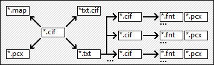

[← readme](../readme.md)

# Documentation

## Introduction

Main application `Editor.exe` present in [*releases section*](https://github.com/Mikulus6/Cultures-map-editor/releases)
provides functionalities necessary to view and modify `*.map` files. This is
enough to freely manipulate terrain, heightmap, landscapes and structures but
not enough to create a fully playable map in game on its own. For this, one
has to construct additional text and image files which, combined with `*.map`
file, can contribute to playable content. These are `*.cif`, `*.fnt`, `*.pcx`
and `*.txt` files. The following documentation is meant to explain how these
additional files are constructed and how to properly modify them.

There are required third-party programs meant for modifying those
files. These are listed below. User is expected to have them installed
alongside `Converters.exe` supplement provided in [*releases section*](https://github.com/Mikulus6/Cultures-map-editor/releases).
Default text and image editors present on commonly known operating systems
might not have enough functionalities, as it might be necessary to manually
change text encoding and to modify a bitmap with indexed colormap.

Each fully functional map consists of at least eight files: `*.cif` (×2),
`*.fnt`, `*.map`, `*.pcx` (×2), `*txt.cif` and `*.txt`. Additionally, there
could be multiple other `*.pcx` and `*.fnt` files included in map files
structure. For basic ideas standing behind these files one is expected to look
up on their own how they are structured inside `data_m` directory in game's
main directory for maps already present in game. If such directory is absent,
it is necessary to extract it from `data_l\data_m.lib` accordingly to
documentation specific for `*.lib` file format. Note that `*.cif` file format
is bidirectionally interchangeable with plain text `*.ini` format, what is
further described in documentations specific for `*.cif` and `*.ini` file
formats. Dependencies between files from which full map is composed are
featured visually on the image below.

Game files contain also other file formats, which are not directly relevant to
the procedure of creating a fully functional map, but can be read or modified
for other purposes such as modding and reverse engineering. These files consist
of formats listed below in compedium alongside other file formats relevant to
the process of creating a map.

## Compendium

### File formats

#### Mapping

 - [`*.cif` Cultures initialization file](formats/cultures_initialization.md)
 - [`*.fnt` Font file](formats/font.md)
 - [`*.ini` Initialization file](formats/initialization.md)
 - [`*.lib` Library](formats/library.md)
 - [`*.map` Map file](formats/map.md)
 - [`*.pcx` Picture exchange](formats/picture_exchange.md)
 - [`*.txt` Text file](formats/text.md)

#### Modding exclusive

 - [`*.bik` Bink video](formats/bink_video.md)
 - [`*.bmd` Bob manager data](formats/bob_manager_data.md)
 - [`*.cdf` Cultures data file](formats/cultures_data.md)
 - [`*.cur` Cursor file](formats/cursor.md)
 - [`*.dat` Data file](formats/data.md)
 - [`*.mp3` Moving picture audio layer](formats/moving_picture_3.md)
 - [`*.ogg` Ogging file](formats/ogging.md)
 - [`*.sav` Save file](formats/save.md)
 - [`*.wav` Waveform audio file](formats/waveform_audio.md)

### Mapping documentation

#### Sections

 - [Control](sections/control.md)
 - [AI](sections/ai.md)
 - [StartUp](sections/startup.md)
 - [Mission](sections/mission.md)
 - [text](sections/text.md)

#### Miscellaneous

 - [Briefings keywords](briefings/text.md)
 - [Numerical limits](briefings/limits.md)

### External programs

#### Mapping

 - [GIMP](https://www.gimp.org/)
 - [Notepad++](https://notepad-plus-plus.org/)

#### Modding exclusive

 - [Audacity](https://www.audacityteam.org/download/)
 - [RAD Video Tools](https://www.radgametools.com/bnkdown.htm)