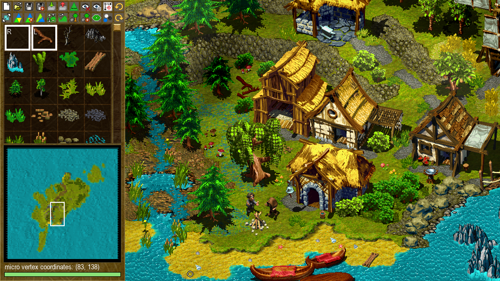

# Cultures Map Editor

## Introduction

Following application is meant to be a tool for map-making process in video
games  [*Cultures: Discovery of Vinland*](https://en.wikipedia.org/wiki/Cultures_(video_game)),
[*Cultures: The Revenge of the Rain God*](https://www.mobygames.com/game/6100/cultures-die-rache-des-regengottes/)
and [*Cultures Gold*](https://www.mobygames.com/game/37471/cultures-gold/).
It makes it possible to freely view and modify map-related files from 
mentioned games. Available functionalities are implemented in a way which
mimics editors present in other games from [*Cultures*](https://de.wikipedia.org/wiki/Cultures_(Computerspielreihe))
series.

## Installation & Usage

### Editor

After downloading necessary files from [*releases section*](https://github.com/Mikulus6/Cultures-map-editor/releases)
make sure to put them in game's main directory, so that the downloaded
executable file `Editor.exe` and game's executable file `Cultures.exe` are in
the same location. Alternatively you can copy `data_l` folder from game files
and paste it to directory of newly downloaded application. It is also possible
to launch the editor in different directory, where game is absent. In case of
such scenario you will be asked to specify manually where game is located.

Optionally, if you want to speed up the program startup you can extract
`data_l\data_v.lib` library to game's main directory. This way, during the
initialization process the application will be able to refer directly to
extracted files rather than search for them in the relatively large library.

Note that when opening the program for the first time it will try to generate
`cache.bin` file which can take significant time to load. If you  want to skip
this process you might be able to find this file online, however due to
copyright restrictions we do not provide access to such file here.
Keep in mind that `cache.bin` files generated for *Cultures: Discovery of
Vinland*, *Cultures: The Revenge of the Rain God* and *Cultures Gold* will
contain different content and are not interchangeable.

Remember that the display of terrain and landscapes in the editor might not be
exactly the same as in the game. Always check important aesthetics by opening
`*.map` files via original game.

Project was tested on Python 3.13 with all used third party
libraries being up to date at the moment of publication.

### Converters

Main `Editor.exe` application supports viewing and modifying only `*.map`
files. These are files that contain information mainly about terrain,
heightmap, landscapes, and structures. For more dynamic elements like
creatures and buildings, more complex matters like missions and bots'
behaviour, or more subtle additions like minimap, fonts and texts, which are
all contained in `*.cif`, `*.fnt`, `*.pcx` and `*.txt` files, it is
recommended to use supplementary `Converters.exe` application provided in
[*releases section*](https://github.com/Mikulus6/Cultures-map-editor/releases)
and read [*documentation*](documentation/index.md).

Take into account that these additional files are not directly supported by
our editor, and it might be necessary for the user to install additional
third-party applications in order to properly read and modify text and images.

One subtle convention present in this project is the separation of the art of
making maps (*mapping*) from the art of creating more general modifications of
game files (*modding*). We define mapping as the process of editing the
content of `data_l\data_m.lib` file and `data_m` directory aimed at making
maps. Functionalities provided by the given tools are meant to give the user
complete control over the mapping process. However, we do not provide an
additional framework, that would support all procedures relevant to the
modding, because it is not the exact topic of this project.

There exists additional functionality, making converters implementable to
further external projects. The `Converters.exe` app can be launched via
command line with additional `--quick-conversions` argument. If this argument
is present, then all further arguments will be interpreted as triplets of
data, and window with user interface will not be initialized. In each triplet,
the first argument is a command name, which can be obtained by running
uncompiled [*converters.py*](./converters.py) script and reading textual
output. The second and third values in each triplet are respectively
responsible for input path and output path relevant to the specific
conversion.

## Credits

This project is a fan-made tool created by [*CulturesNation*](https://culturesnation.pl/)
community. It is not affiliated with the official legacy of *Cultures* series.
For official developers' website visit [*Funatics*](https://www.funatics.de/).

### Contributors

[Mikulus](https://github.com/Mikulus6): Managed project and wrote most of Python code.  
[Basssiiie](https://github.com/Basssiiie): Decompiled important parts of game's engine via Ghidra.  
[Peti](https://retroachievements.org/user/LittlePetbob): Tested and documented part of textual scripts entries.  
[Tyrannica](https://github.com/ARKAMENTOR): Helped with walk sectors' data visualization.  
[Proszak](https://www.facebook.com/PigmentDesignStudio): Drew some of the graphics for user interface.

### Literature

[Watto](https://github.com/wattostudios): "[*Game Extractor*](https://www.watto.org/game_extractor.html)" (2004)  
[Bacter](mailto:the.bacter@gmail.com): "[*Unknown Encryption In Cultures Game*](https://web.archive.org/web/20210724220815/https://forum.xentax.com/viewtopic.php?t=3711)" (2010)  
[Siguza](https://github.com/Siguza): "[*Cultures 2 file formats*](https://web.archive.org/web/20210724220815/https://forum.xentax.com/viewtopic.php?t=10705)" (2013)  
[FinFET](https://github.com/FinFetChannel): "[*SimplePython3DEngine*](https://github.com/FinFetChannel/SimplePython3DEngine)" (2022)  
[Remik](https://github.com/kamil0495): "[*CEngine*](https://github.com/kamil0495/CEngine)" (2023)

### License

This program and its source code are distributed under [*GNU General Public License 3.0*](https://www.gnu.org/licenses/gpl-3.0.txt),
which can be found in the [*license.txt*](license.txt) file. *Cultures* itself
is the property of [*Funatics Software*](https://www.funatics.de/) with all
rights reserved as stated in the game manual, and is not covered by the
aforementioned license.